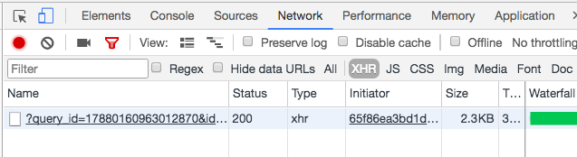
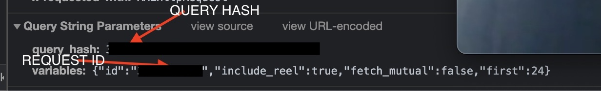
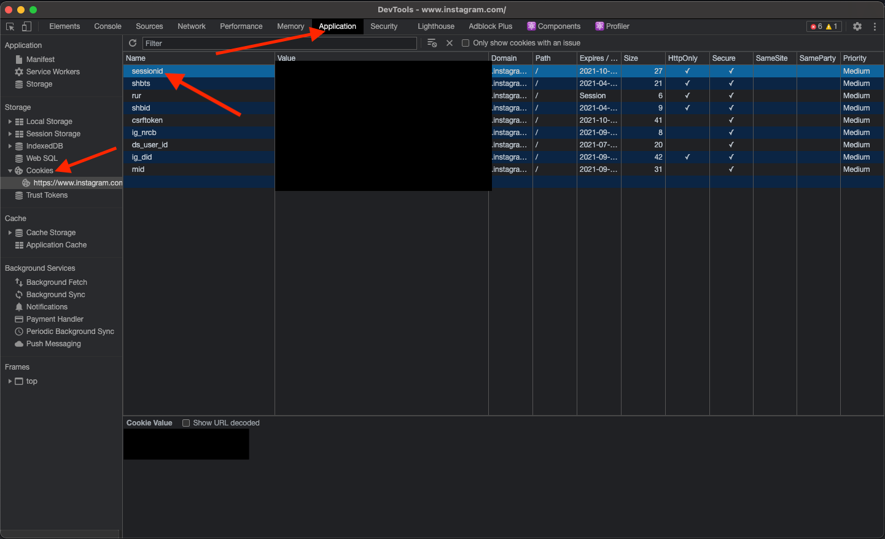

# Setup

## Installation

```shell
python3 -m pip install -r requirements.txt
```

Make a file named `.env`. This is where your account specific files will be stored
The .env file will look like the following:

```env
FOLLOWINGHASH="Your following hash here"
FOLLOWERHASH="Your follower hash here"
REQUEST_ID="Your request id here"
SESSION_ID="Your session id here"
```

## How to get your following/follower hash

Instagram uses GraphQL for its API, and needs a mandatory parameter named
`query_hash` to make the internal requests.

> Instagram also supports a parameter named `query_id` but since
> there is no easy way to get one, we'll keep the `query_hash` parameter
> instead.

This is an easy method to get your query hash. Once you get one, you don't need
to worry about this anymore.

1. Run your browser and go to your instagram page`http://www.instagram.com/yourusernamehere/`.

2. Then, go to `Inspect Elements > Network > xhr`.<br />
   

3. Click on **following** which should bring up the people you are following you have.<br />
   

4. Click on the XHR query which pops up.<br />
   

5. Scroll down and copy the `query_hash` and the `id`. Put the values in the proper places in the .env file. This hash is your following hash. Note: you will also have an id in your following hash but you only need this one.<br />
   

6. Get the follower hash in the same way and put it in the .env file

7. Now you will need to get your session ID. Go to the **Application** tab and then open cookies on the left <br />
   

## You're done!

# Running

```shell
python3 instagram.py

```

Program takes a while to run depending on your followers/people you are following
When it finishes it will print everyone that is not following you as well as write to a
`.txt` file.

```

```
